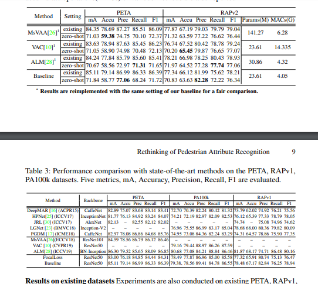

## Topic : Person Attribute Recognition

**Objective** : To improve the base line code and achieve better results than current SOTA(please see this paper for the accuracy that we have to achieve "Rethinking of Pedestrian Attribute Recognition:
Realistic Datasets and A Strong Baseline" - https://arxiv.org/pdf/2005.11909.pdf )

### Important links :

**Base line code** - https://github.com/valencebond/Strong_Baseline_of_Pedestrian_Attribute_Recognition

**Base line codes paper** - "Rethinking of Pedestrian Attribute Recognition: Realistic Datasets and A Strong Baseline" https://arxiv.org/pdf/2005.11909.pdf

**All Datasets link** - https://github.com/wangxiao5791509/Pedestrian-Attribute-Recognition-Paper-List

**Literature survey** - All papers related to it - https://github.com/wangxiao5791509/Pedestrian-Attribute-Recognition-Paper-List

**Another base line code (but its not working with Rapv2 dataset)** - https://github.com/dangweili/pedestrian-attribute-recognition-pytorch

**Current Accuracies:**
(Taken from https://arxiv.org/pdf/2005.11909.pdf)

**Methods or different models available :**
Example :

https://arxiv.org/pdf/2005.11576.pdf

**Datasets that we are going to focus on :**
PA100k 
RAPv2
PETA
RAPv1
The school of AI dataset - will send it later 
Market 1501 (optional)

**Project Schedule :** (Even if planned schedule didnt work its not a problem we can try to achieve it else we can reschedule)

Since we have a base line code and datasets already we need to improve the model alone thats enough . Each one can take a dataset and work on improving a model for that if any one gets a improvement in any one dataset we can proceed with that model .

Current baseline is on Resnet50 so we can think of using inception ,densenet or any other suitable network .

Literature survey 4 days 

I think 12 days is enought for find a new model . 
so with in  August 2 lets try to find a model that better than current model

So in august month 1- 15 we can write our paper .

July 17 - July 20 - Literature survey

July 21 - Aug 2 - Model preparation

Aug 2 - Aug 20 - Training part

Aug 20 - Aug 30 - paper writing

**Accuracy to be achieved :**

Name   - Precision

Pa100k - 89.41

Rapv2- 81.99

PETA - 86.99

Rapv1 - 82.84

MARKET-1501 - (optional)

TSAI - (Any thing is okay as along as above is satisfied)

**Works done :**

####### Coding part starts ###########################

19-07-2020 - Attached the notebooks to run the file on pa100k and rapv2 dataset with baseline code 

26-07-2020 - Added Vgg models code to run pa100k - (Vgg_valencebond_PA100k_notebook (1).ipynb)

30-07-2020 - Added Densenet models code to run pa100k - (Dense_net_PA100k_notebook.ipynb)  - modified the input channel and batch size

30-07-2020 - Added Mobilenet models code to run pa100k - (Mobile_net_PA100k_notebook.ipynb) - modified input channel

30-07-2020 - Added MNAS net - (MNAS_net_PA100k_notebook.ipynb)

30-07-2020 - Added Squeeze net - (Squeze_net_PA100k_notebook.ipynb)

30-07-2020 - Added Alex net - (Alexnet_net_PA100k_notebook.ipynb)

30-07-2020 - Added Inception net - (Inception_net_PA100k_notebook.ipynb)

30-07-2020 - Added SE_resnet net - (se_resnet_net_PA100k_notebook.ipynb)

######### Coding part Completed ###########################

Authors of the base paper have not released original pkl file or dataset so we are going with existing methods

######### Hyper tunning and training part Start ###########################

### Pa100k 

Dataset link - 

| Model name | Ckpt file | logs file | png file of final accuracy | epochs trained | number of trainval and test data |
| --- | --- | --- | --- | --- | --- | 
| Resnet50 | [drive](https://drive.google.com/file/d/1_F9gPOwwPrQUDfJyfAFVNnwFfiOXSe-M/view?usp=sharing) | [drive](https://docs.google.com/document/d/13YE5wJRlxgLH6xaUtkjdYl2kd2tzSM8-E0qy602z7Xg/edit?usp=sharing)| ma: 0.7992, Acc: 0.7853, Prec: 0.8718, Rec: 0.8667 | 50 | trainval set: 90000, test set: 10000, attr_num : 26 |
| Densenet121 | [drive](https://drive.google.com/file/d/1uR6weiL5cy7-GTtZfQJ6MeMuJlETBtHL/view?usp=sharing) | [drive](https://docs.google.com/document/d/1BAaB6z8y5hgv0d1bO2qAohJMlD6sJu-u968DpLcbcw4/edit?usp=sharing)|  ma: 0.7579, Acc: 0.7448, Prec: 0.8460, Rec: 0.8358 | 50 | trainval set: 90000, test set: 10000, attr_num : 26 |
| Alexnet | [drive](https://drive.google.com/file/d/16xo6nyM7sZ8rZEKN4rtq2lO0LJ2CVMZi/view?usp=sharing) | [drive](https://docs.google.com/document/d/10_MCfFhN2Lkbj2oGnO0yyyPFgz9X0gsKM26vfKiNzq8/edit?usp=sharing) | ma: 0.7584, Acc: 0.7472, Prec: 0.8461, Rec: 0.8384 | 50 | trainval set: 90000, test set: 10000, attr_num : 26 |
| mnasnet
| shufflenetv2
| squeezenet | [drive](https://drive.google.com/file/d/1cOuE9a5PxISjVtNeQGPLlwovjysePFeP/view?usp=sharing) | [drive](https://docs.google.com/document/d/19F-q4nXUmXywYa-CZUvI5Tu6kYjwkE-_fqRbaUmP-QA/edit?usp=sharing) | ma: 0.7203, Acc: 0.7016, Prec: 0.8234, Rec: 0.8039 | 50 | trainval set: 90000, test set: 10000, attr_num : 26 |
| vgg | [drive](https://drive.google.com/file/d/1F4DMX5tuqfwTig-L7J0PWZUd2JIMHfBn/view?usp=sharing) | [drive](https://docs.google.com/document/d/1m686ZghKw0QIqgg_pErDXuPmtO1ayuZKuIxKYKi78WU/edit?usp=sharing) |  ma: 0.7711, Acc: 0.7333, Prec: 0.8391, Rec: 0.8303 | 50 | trainval set: 90000, test set: 10000, attr_num : 26 |
| inception (optional if it works)
| seresnet 

### Rapv2 

Dataset link - 

| Model name | Ckpt file | logs file | snap -png file of final accuracy | epochs trained | number of trainval and test data |
| --- | --- | --- | --- | --- | --- | 
| Resnet50 | [drive](https://drive.google.com/file/d/17Mxm90621He58LzAoQyERdJ98NJ6C_cJ/view?usp=sharing) | [drive](https://docs.google.com/document/d/1rM57imAnr_PZAhINtqFFlFnm0Zar9T3qSpc1mSJSwmA/edit?usp=sharing) | ma: 0.7862, Acc: 0.6640, Prec: 0.7794, Rec: 0.7974 | 50 | trainval set: 67943, test set: 16985, attr_num : 54 |
| Densenet121 | [drive](https://drive.google.com/file/d/1Tvw98ZBc73mcLLuwUpr6debnfKlCTSs-/view?usp=sharing)| [drive](https://docs.google.com/document/d/1vLNnuoh7uIXG7zLeM6TW_BEZE_35DlnizPPd2x2OQiA/edit?usp=sharing) |  ma: 0.7666, Acc: 0.6488, Prec: 0.7729, Rec: 0.7801 | 50 |
trainval set: 67943, test set: 16985, attr_num : 54 |
| Alexnet | [drive](https://drive.google.com/file/d/1g3C2eMJNGqSDFV36khL4HQO2QQKAFZPe/view?usp=sharing) | [drive](https://docs.google.com/document/d/1cFnSCNkDgtSHUXQxLRU1acf4oySrV0uUyFiBoKUzQ3Q/edit?usp=sharing)| ma: 0.7252, Acc: 0.6150, Prec: 0.7618, Rec: 0.7431, F1: 0.7468| 50| trainval set: 67943, test set: 16985, attr_num : 54 |
| mnasnet
| shufflenetv2
| squeezenet | [drive](https://drive.google.com/file/d/1MRxfnImg82DKpgm7w48uCHbchByKUsu-/view?usp=sharing) | [drive](https://docs.google.com/document/d/1ny7gBsiQb9FIvm1BqHGDY68_cu2e1glqhraWUnC-7HM/edit?usp=sharing) | ma: 0.7407, Acc: 0.6270, Prec: 0.7569, Rec: 0.7674 | 50 | trainval set: 67943, test set: 16985, attr_num : 54
| vgg | [drive](https://drive.google.com/file/d/1XCUMdN0TjZJGUFOQ6A71cMYJvv0Uv9y6/view?usp=sharing) | [drive](https://docs.google.com/document/d/1fK3sj1Pos3tjVsjTggpSp0nK8uwleVlZ3YuywggpeW8/edit?usp=sharing)| ma: 0.7407, Acc: 0.6270, Prec: 0.7569, Rec: 0.7674, | 50 | trainval set: 67943, test set: 16985, attr_num : 54
| inception (optional if it works)
| seresnet 

### PETA

Dataset link - 

| Model name | Ckpt file | logs file | png file of final accuracy | epochs trained | number of trainval and test data |
| --- | --- | --- | --- | --- | --- | 
| Resnet50  | drive | drive | ma: 0.8522, Acc: 0.7924 | 50 | trainset -11400, test set: 7600
| Densenet121 | drive | drive | - | 50 | trainset -11400, test set: 7600
| Alexnet | drive | drive | - | 50 | trainset -11400, test set: 7600
| mnasnet | drive | drive | - | 50 | trainset -11400, test set: 7600
| shufflenetv2 | drive | drive | - | 50 | trainset -11400, test set: 7600
| squeezenet | drive | drive | - | 50 | trainset -11400, test set: 7600
| vgg | drive | drive | - | 50 | trainset -11400, test set: 7600
| inception (optional if it works) |
| se_resnet  | drive | drive | - | 50 | trainset -11400, test set: 7600

Will update the accuracys soon

Resnet results - https://drive.google.com/drive/u/1/folders/1-FlKmYoj7wE0TsAgEjjFUqzAl_6-u6Eu 

### PAU-TSAI

Dataset link - 

| Model name | Ckpt file | logs file | snap -png file of final accuracy | epochs trained | number of trainval and test data |
| --- | --- | --- | --- | --- | --- | 
| Resnet50
| Densenet121
| Alexnet
| mnasnet
| shufflenetv2
| squeezenet
| vgg
| inception (optional if it works)
| seresnet 

