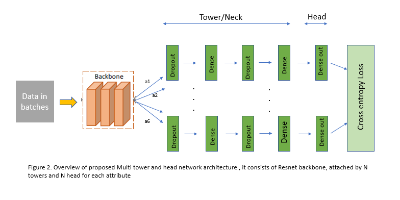
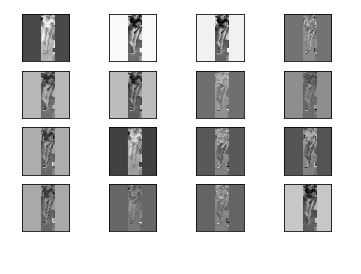

### DeepMTH Net - Deep Multi Tower Head network 

This is Keras implementation of Deep Multi Tower Head network for the task of person attribute recognition

[Perception of Deep Multi Tower Head Network on Person Attribute Recognition](https://dl.acm.org/doi/abs/10.1145/3447450.3447470), ICVIP 2020 

**Dataset** - HA-TSAI - Human Attributes-The School of A.I

### Architecture



**Installation**

Creating conda environment:

    conda create -n ha-tsai python=3.6
    conda activate ha-tsai

Installing requirements

``` pip install requirements.txt ```

**Traning model**

Train a model from scratch

``` python main.py```

Train a model after certain epochs [To be done]

``` python main.py --middle ```

Test a trained model by loading weights [To be done]

``` python test.py --modelpath ```


### Visuvalize feature maps



### Credits

- [Rohan Shravan ](https://in.linkedin.com/in/rohanshravan)
- [The School of A.I](https://theschoolof.ai/)
- Co Authors of paper

### Cite

Please site our paper if you use this code in your own work:

```
@inproceedings{ajith2020deepmth,
  title={Perception of Deep Multi Tower Head Network on Person Attribute Recognition},
  author={Ajith Kumar V, Hammad Ali, Feng Sun, Deepjyoti Saha, IIlias Papachristos},
  booktitle={The 4th International Conference on Video and Image Processing(ICVIP2020)},
  year={2020}
}

Kumar V A, Ali H, Sun F, et al. Perception of Deep Multi Tower Head Network on Person Attribute Recognition[C]//2020 The 4th International Conference on Video and Image Processing. 2020: 122-127.

```