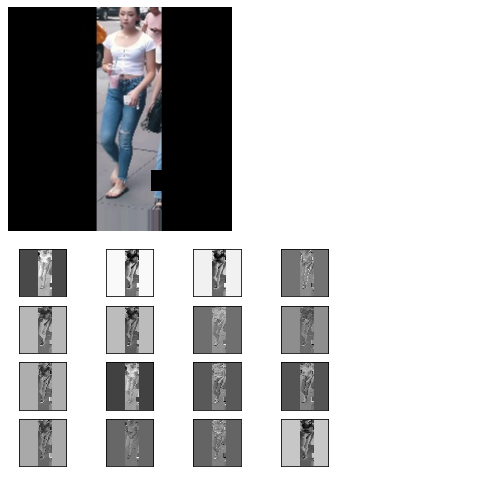

### Perception of Deep Multi Tower Head Network on Person Attribute Recognition

Model: Deep MTH = Deep Multi Tower Head Network

Dataset released: HA-TSAI =s Human Attributes-The School of A.I

Creating conda environment:

```conda create -n ha-tsai python=3.6```

```conda activate ha-tsai```

Installing requirements

``` pip install requirements.txt ```

Train a model from scratch

``` python main.py```

Train a model after certain epochs [To be done]

``` python main.py --middle ```

Test a trained model by loading weights [To be done]

``` python test.py --modelpath ```

### Architecture


### Visuvalize feature maps



Time took to complete this paper from scratch to end:

(Team formation,Topic selection to the end of publishing in arxivx)

July 2020 to October 2020


### Credits

- [Rohan Shravan ](https://in.linkedin.com/in/rohanshravan)
- [The School of A.I](https://theschoolof.ai/)


Please site our paper if our Dataset or our model(Deep-MTH) helps you in your research

Citations:
